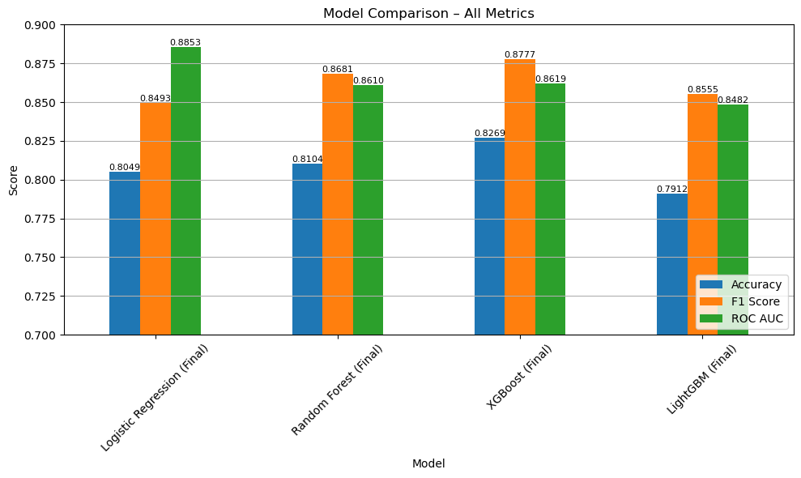
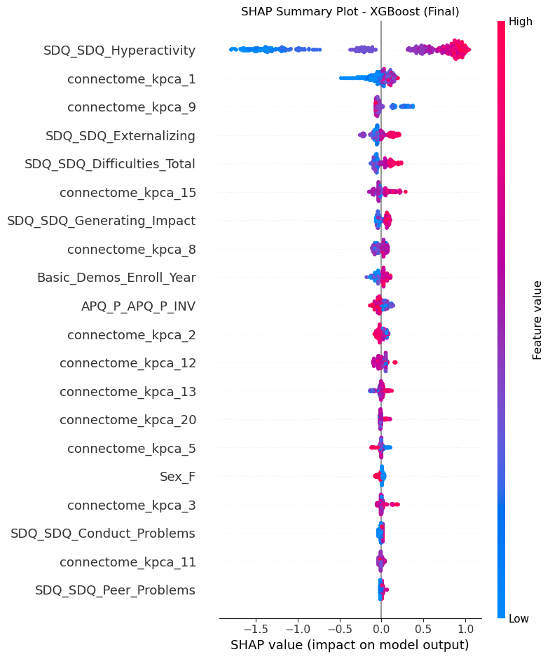
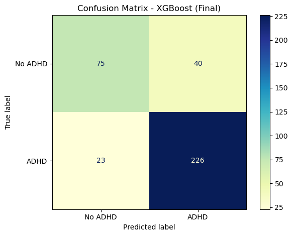
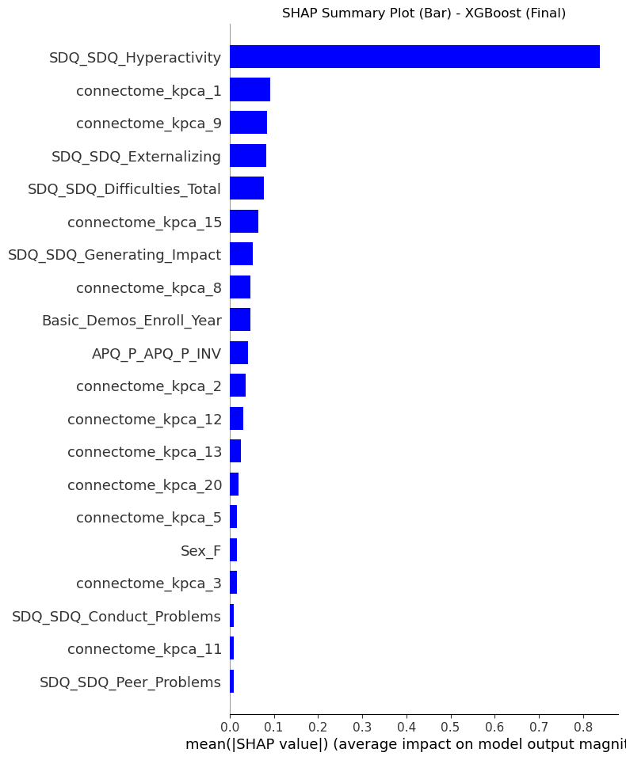
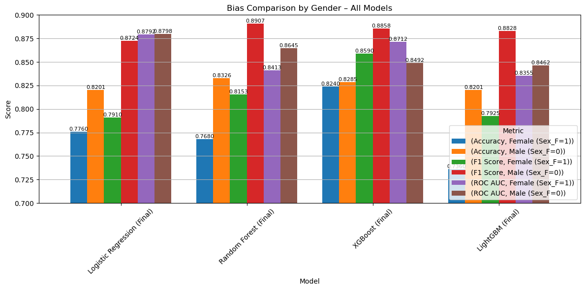

# ADHD Explainable AI

An explainable machine learning framework for ADHD classification using SHAP, Kernel PCA, neuroimaging, psychometric, and demographic data.

## Visual highlights



*Recorded accuracy, F1, and ROC AUC for four fitted classifiers. These historical results are subject to the preprocessing-leakage limitation described below.*



*SHAP value distributions for the recorded XGBoost model, showing global model behavior rather than causal or clinical effects.*

## Overview

This project explores binary ADHD outcome classification from functional-connectome components, psychometric measures, and demographic variables. The recorded workflow merges 1,213 participant records, prepares a stratified 70/30 train/test split, reduces 19,900 connectome measurements to 20 radial-basis-function Kernel PCA components, evaluates four classifiers, and uses SHAP to inspect fitted-model behavior.

The repository preserves historical results as evidence of the original experiment. It does not present the model as a diagnostic system or as validated for clinical, regulatory, or production use.

## Responsible-use notice

This is a retrospective machine learning project, not a medical device. Its predictions must not be used to diagnose, screen, treat, or make decisions about individuals. SHAP values describe associations within a fitted model; they do not establish causation. Sex-disaggregated metrics are exploratory subgroup comparisons, not a fairness certification.

## Project highlights

- 1,213 merged participant records in the local source data
- 19,900 functional-connectome measurements per participant
- 10 selected numeric/psychometric features and 8 selected demographic features
- 20 Kernel PCA connectome components
- Logistic Regression, Random Forest, XGBoost, and LightGBM comparisons
- Five-fold stratified cross-validation with F1-based model selection
- Held-out accuracy, F1, ROC AUC, and confusion-matrix evaluation
- Tree SHAP global explanations for ensemble models
- Exploratory female/male subgroup metrics

## Dataset overview

The local project contains four inputs, all excluded from version control:

| Input | Recorded shape | Role |
|---|---:|---|
| Labels | 1,213 × 3 | Participant ID, ADHD outcome, and `Sex_F` |
| Metadata A | 1,213 × 19 | Numeric psychometric and scan-age variables |
| Metadata B | 1,213 × 10 | Coded demographic and contextual variables |
| Connectome matrix | 1,213 × 19,901 | Participant ID plus 19,900 connectivity values |

The filenames and embedded workbook provenance are consistent with the [WiDS Datathon 2025 Global Challenge](https://www.widsworldwide.org/get-inspired/blog/8th-annual-wids-datathon-challenges-unraveling-the-mysteries-of-the-female-brain/), which describes data supplied by the Child Mind Institute's [Healthy Brain Network](https://childmind.org/science/global-open-science/healthy-brain-network/). The local files do not include a license or terms document, so this attribution must be confirmed against the authors' original download before any data reuse.

## Data availability

No source, processed, split, or participant-level dataset is published here. Authorized users must obtain the data from the original provider and comply with its current access, privacy, citation, and redistribution terms. See [data/README.md](data/README.md) for the expected local filenames.

## Problem definition

The recorded target is binary `ADHD_Outcome`. `Sex_F` is retained as a predictor and is also used for exploratory subgroup evaluation. The experiment does not establish diagnostic validity, treatment utility, or generalization beyond the recorded sample.

## Data-preparation workflow

1. Merge labels, numeric metadata, categorical metadata, and connectome values by `participant_id`.
2. Create a combined sex/outcome label and make a 70/30 stratified split with `random_state=42`.
3. Fit a five-neighbor KNN imputer on numeric training metadata and transform the test metadata.
4. Fill missing coded demographic values with `3`, described in the notebook as “Unknown.”
5. Rank numeric and demographic features with mutual information on the training partition; retain 10 and 8 features respectively.
6. Standardize the connectome matrix and reduce it to 20 RBF Kernel PCA components (`gamma=0.001`).
7. Merge selected metadata, connectome components, `Sex_F`, and the outcome into 849-row training and 364-row test tables.
8. Standardize model inputs using training-set statistics while leaving `Sex_F` unscaled.

## Models and optimization

The modeling notebook records five-fold `StratifiedKFold` cross-validation with shuffling and `random_state=42`. Logistic Regression uses grid search; the three ensemble models use randomized search with 10 sampled parameter combinations. F1 is the tuning score.

| Model | Recorded mean CV F1 | Accuracy | Test F1 | ROC AUC |
|---|---:|---:|---:|---:|
| Logistic Regression | 0.8088 | 0.8049 | 0.8493 | 0.8853 |
| Random Forest | 0.8548 | 0.8104 | 0.8681 | 0.8610 |
| XGBoost | 0.8554 | 0.8269 | 0.8777 | 0.8619 |
| LightGBM | 0.8529 | 0.7912 | 0.8555 | 0.8482 |

These are preserved notebook outputs, not recomputed metrics. XGBoost recorded the highest held-out accuracy and F1; Logistic Regression recorded the highest ROC AUC.

## Explainability

The experiment uses coefficient inspection for Logistic Regression and `shap.TreeExplainer` for Random Forest, XGBoost, and LightGBM. The selected XGBoost explanation is based on the 39-feature test representation: 10 selected numeric/psychometric features, 8 selected demographic features, 20 connectome Kernel PCA components, and `Sex_F`.

The SHAP plots provide global summaries across test examples. The repository does not record a separately constructed local explanation for a named individual, and no causal interpretation is claimed.

## Exploratory subgroup analysis

Metrics were calculated separately for the two recorded `Sex_F` groups. For XGBoost, the notebook records accuracy of 0.8240 and 0.8285, F1 of 0.8590 and 0.8858, and ROC AUC of 0.8712 and 0.8492 for female and male groups respectively.

No confidence intervals, hypothesis tests, calibration analysis, intersectional analysis, or external subgroup validation are recorded. Small observed gaps must not be described as statistical significance or universal fairness.

## Selected project figures



*Recorded XGBoost confusion matrix: 75 true negatives, 40 false positives, 23 false negatives, and 226 true positives.*



*Mean absolute SHAP values for the recorded XGBoost model.*



*Exploratory metrics across the two recorded sex groups; this is not a fairness certification.*

## Project structure

```text
.
├── README.md
├── requirements.txt
├── data/
│   └── README.md
├── processed_data/
│   └── README.md
├── final_data/
│   └── README.md
├── notebooks/
│   ├── README.md
│   ├── 01_data_exploration.ipynb
│   └── 02_modeling_and_testing.ipynb
└── docs/
    └── images/
```

The two primary notebooks are included with their recorded saved outputs intact. They were not rerun during repository preparation. Checkpoint notebooks and generated train/test CSV files remain excluded. See [notebooks/README.md](notebooks/README.md).

## Technology stack

Python, pandas, NumPy, Matplotlib, seaborn, scikit-learn, SHAP, XGBoost, LightGBM, OpenPyXL, and IPython. Notebook metadata records Python 3.12.7; compatibility with a clean environment has not been independently reproduced.

## Local setup

Create an isolated environment and install the verified direct dependencies:

```bash
python -m venv .venv
source .venv/bin/activate
python -m pip install -r requirements.txt
```

Place authorized source files in `data/`. The included notebooks use `notebooks/` as their working directory; their `../data` and `final_datasets` paths are relative to that location.

## Notebook execution order

The recorded local workflow is:

1. `01_data_exploration.ipynb`
2. `02_modeling_and_testing.ipynb`

Obtain the original dataset independently and place the required files in `data/` before execution. Running the first notebook writes derived CSV files under `notebooks/final_datasets/`, which remains ignored by Git.

## Reproducibility notes

- Notebook outputs, figures, and metrics were preserved without rerunning either notebook.
- Package versions were not recorded, so dependencies are intentionally unpinned.
- Random seeds are recorded for the split, mutual information, Kernel PCA, cross-validation, and model searches.
- No serialized fitted model is present.
- Exact end-to-end reproducibility has not been established in a clean environment.

## Methodological limitations

Most importantly, the recorded preprocessing fits `StandardScaler` and Kernel PCA to the complete 1,213-row connectome matrix before selecting train and test rows. This exposes the dimensionality-reduction pipeline to held-out feature distributions and makes the reported test metrics optimistic as estimates of unseen-data performance. A future experiment should fit all learned preprocessing inside the training partition, preferably within each cross-validation fold, and then evaluate once on an untouched test set.

Additional limitations include a single internal split, no external validation, no confidence intervals, no probability calibration analysis, no decision-curve analysis, and no recorded statistical testing of subgroup differences.

## Ethical and clinical limitations

The dataset concerns young participants and sensitive health-related characteristics. De-identification does not eliminate re-identification risk, and participant-level records must remain protected. The model is not clinically validated, is not a diagnosis tool, and should not be used for individual decisions. Any future use would require independent validation, governance, privacy review, bias analysis, and domain-expert oversight.

## Authors

This project was developed by Alireza Zaeri and Fatemeh Sabourinia.

- [Alireza Zaeri on GitHub](https://github.com/alirezazaeri)
- Alireza Zaeri LinkedIn: pending verification of the author's exact profile URL
- Fatemeh Sabourinia

## Dataset attribution

The apparent upstream dataset is the WiDS Datathon 2025 Global Challenge dataset, described by WiDS Worldwide as derived from Healthy Brain Network data supplied by the Child Mind Institute. Confirm the exact competition citation and terms from the original download before reuse or publication.

## License status

No project license is applied. The local materials do not establish complete code ownership, dataset redistribution rights, or permission to relicense upstream data. All rights remain with their respective owners until the authors complete a provenance and licensing review.
